# Project_2

Project for "Virtualized and Softwarized mobile networks" course held by Dr. Granelli @ UniTN

It is based on two of the project presented by the professor: 
- `Interactive topology display for SDN networks`: providing an interactive display of the topology of an SDN network;
- `On Demand SDN Slices in ComNetsEmu`: implement a network slicing approach to enable dynamic activation/de-activation of network slices via CLI/GUIcommands.

Basically, it consists of a web application that displays the topology created using Ryu and allows to perform three different on-demand slicing through the UI.

## Table of Contents

- [Requirements](#requirements)
- [Project Structure](#project-structure)
- [Installation Procedure](#installation-procedure)
- [Access web application outside vagrant](#access-web-application-outside-vagrant)
- [How to run the project](#how-to-run-the-project)
- [Topology and slicing](#topology-and-slicing)
  - [Default scenario](#default-scenario)
  - [Slice 2 scenario](#slice-2-scenario)
  - [Slice 3 scenario](#slice-3-scenario)
  - [Both scenario](#both-scenario)
- [Useful Mininet commands](#useful-mininet-commands)
- [Documentation](#documentation)

## Requirements

- Vagrant
- VirtualBox
- NodeJS
- npm
- python3
- Mininet
- Ryu
- ComNetsEmu

## Project Structure

Here is represented the project tree expanding only the relevant files:

```bash
📦Project_2
 ┣ 📂html
 ┃ ┣ 📜index.html
 ┃ ┣ 📜script.js
 ┃ ┗ 📜style.css
 ┣ 📂images
 ┣ 📂node_modules
 ┣ 📂script
 ┃ ┣ 📜defaultScenario.sh
 ┃ ┣ 📜resetScenario.sh
 ┃ ┣ 📜slice2+3Scenario.sh
 ┃ ┣ 📜slice2Scenario.sh
 ┃ ┣ 📜slice3Scenario.sh
 ┃ ┗ 📜start.sh
 ┣ 📂topologyVisualizer
 ┃ ┣ 📂__pycache__
 ┃ ┣ 📂frontend
 ┃ ┃ ┣ 📜host.svg
 ┃ ┃ ┣ 📜index.html
 ┃ ┃ ┣ 📜router.svg
 ┃ ┃ ┣ 📜ryu.topology.js
 ┃ ┃ ┗ 📜style.css
 ┃ ┣ 📜controller.py
 ┃ ┣ 📜gui_start.py
 ┃ ┗ 📜topology.py
 ┣ 📜.gitignore
 ┣ 📜README.md
 ┣ 📜app.js
 ┣ 📜launch.sh
 ┗ 📜package.json

```


The main folders and file are:

- `launch.sh` that clears mininet and starts the application.
- `app.js` starts the web application and launch bash scripts to dynamically change the status of the slices.
- `script/` containts the bash scripts that are launched by the app.js
- `html/` contains the frontend of the visualizer.
- `topologyVisualizer/` contains the ryu controller, the gui_start needed to visualize the topology and the topology of the network.

## Installation procedure

Assuming you already have npm, python3 and nodejs on your machine.

Since it is **Strongly advised** to set up comnetsemu in a Virtual Machine in order to ensure portability, you should follow these steps:

1. Install [Vagrant](https://www.vagrantup.com) and [VirtualBox](https://www.virtualbox.org)
2. Install [Comnetsemu](https://git.comnets.net/public-repo/comnetsemu#installation)

## Access web application outside vagrant

In order to be able to access to the visualizer using a browser, you need to create a private network between the Virtual Machine and your local machine. To achieve this you have to:

1. Go to comnetsemu installation folder

```bash
~$ cd <comnetsemu_location>
```

2. Once you are in the directory you can perform an `ls` and you should see the `Vagrantfile`. From here, open it and copy this line in the file to create the private network

```bash
config.vm.network "private_network", ip: "192.168.56.2"
```

We will use the IP `192.168.56.2:8081` to access the web application.

## How to Run the project

Our `<comnetsemu_location>` is `~/comnetsemu`, so we're going to use this from now on.

1. Go to comnetsemu location

```bash
~$ cd comnetsemu
```

2. Start your Virtual machine

```bash
~$ vagrant up comnetsemu
```

3. Connect to it trough ssh

```bash
~$ vagrant ssh comnetsemu
```

4. Go to the project folder

```bash
~$ cd comnetsemu/Project_2
```

5. Run the bash file to start the webapp

```bash
~$ bash ./launch.sh
```

6. Once the webapp is up and running open your favourite browser and paste

```
http://192.168.56.2:8081
```

Now you can interact with the WebApp!

In the terminal where you ran the bash script you are given the mininet's CLI. In this way you can perform checks on the slices in real time!

**Note** in step 2 and 3 it is not necessary to call `comnetsemu` after vagrant up and ssh, but it is advised in case of multiple VMs running in your machine at the same time.

## Topology and Slicing

We decided to keep this topology for the project:

### Default Scenario

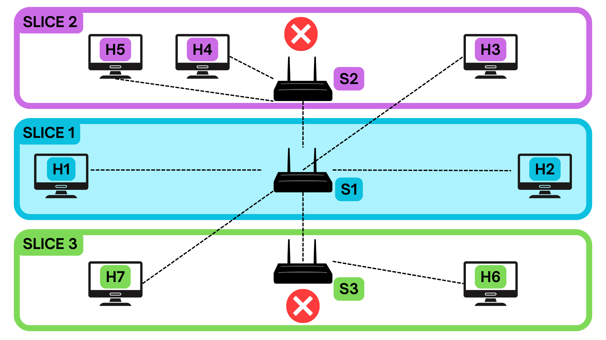</img>

In the Default Scenario we have 3 hosts, 2 switches and 1 slice of 10 Mbps between h1, h2 and h3.

This is what we are going to get with the pingall command

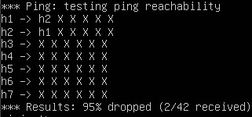</img>

If we check the connection among the hosts we get:

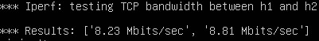</img>

### Slice 2 Scenario

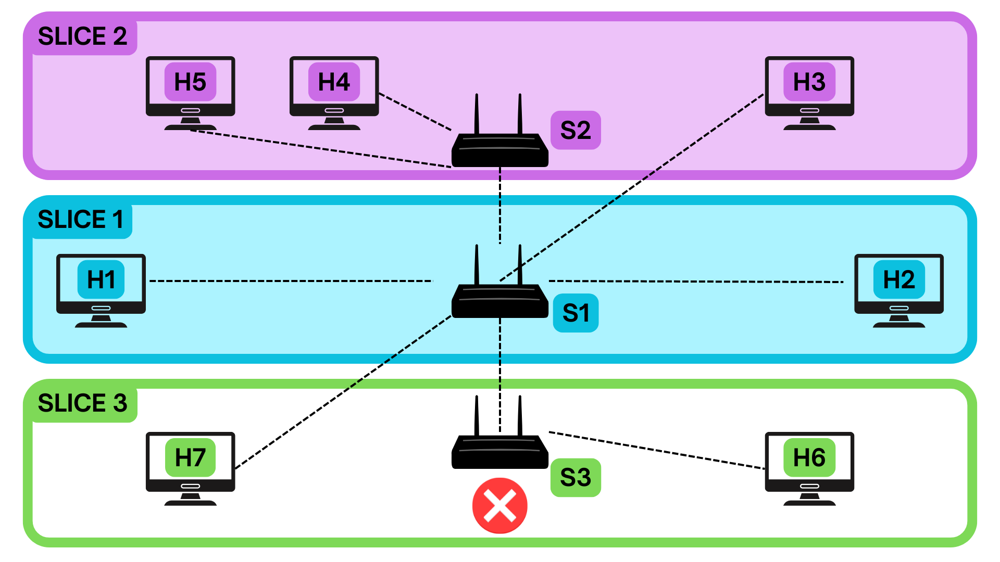</img>

When the Slice 2 scenario is active, we add host 4 and host 5 to network.

This scenario has 5 hosts, 2 switches and 2 slices:

- Slice 1 between h1, h2 and h3 using a 6 Mbps link
- Slice 2 between h4 and h5 using a 4 Mbps link

This is what we are going to get with the pingall command

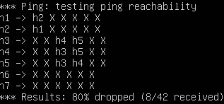</img>

If we check the connection among the hosts we get:

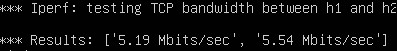</img>

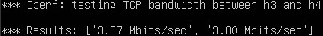</img>

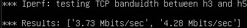</img>

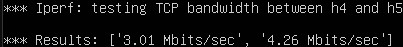</img>

### Slice 3 Scenario

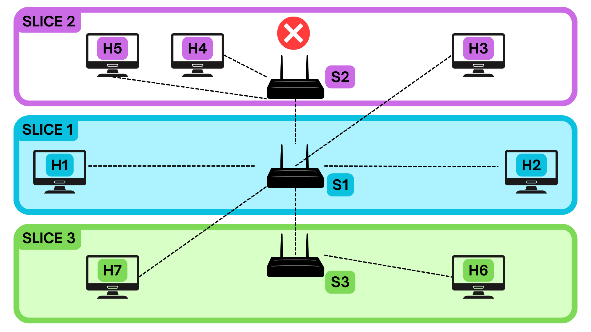</img>

When the Slice 3 scenario is active, we add host 6 and host 7 to network.

This scenario has 5 hosts, 3 switches and 2 slices:

- Slice 1 between h1, h2 and h3 using a 6 Mbps link
- Slice between h6 and h7 using a 4 Mbps link

This is what we are going to get with the pingall command

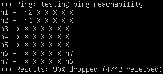</img>

If we check the connection among the hosts we get:

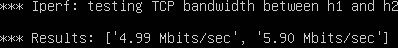</img>

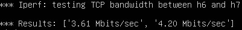</img>

### Both Scenario

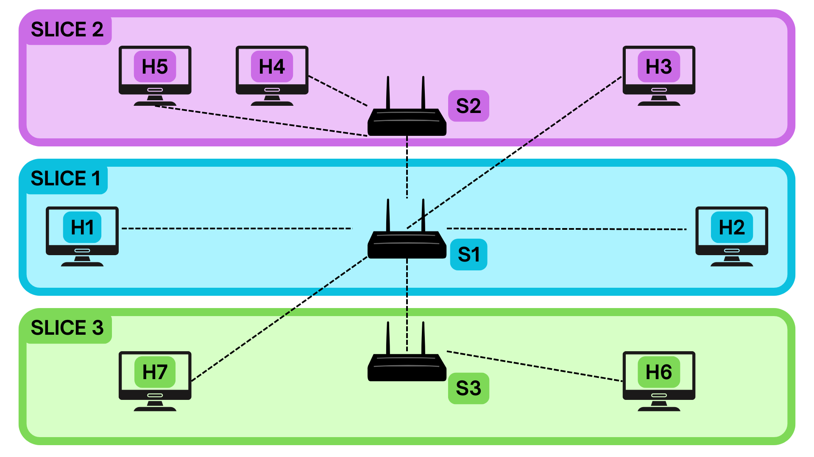</img>

When both, Slice 2 and Slice 3 scenario are active, we add host 4, host 5 host 6, host 7 to network.

This scenario has 7 hosts, 3 switches and 3 slices:

- Slice 1 between h1, h2 and h3 using a 2 Mbps link
- Slice 2 between h4 and h5 using a 4 Mbps link
- Slice between h6 and h7 using a 4 Mbps link

This is what we are going to get with the pingall command

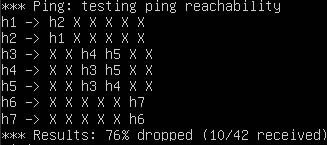</img>

If we check the connection among the hosts we get:

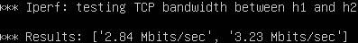</img>

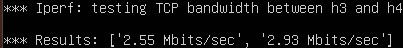</img>

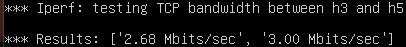</img>

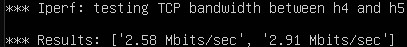</img>

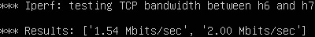</img>

## Useful Mininet commands

Once the application is up and running you can run some code in mininet to check the status of the network.

The `mininet>` is used instead of `~$` to underline the fact that we are inside the mininet CLI while the application is running and not on the standard terminal.

The most useful commands are:

- `mininet> nodes` to check the available nodes in the network
- `mininet> links ` to display network's links
- `mininet> pingall`, which lets all hosts ping each other
- `mininet> <src_host> ping <dst_host>` e.g. `h1 ping h3` which lets an host send some packets through the network to check its reachability
- `mininet> iperf <src_host> <dst_host>` e.g. `iperf h1 h3` which lets an host check the bandwidth available

## Documentation

For more information on the tools used please read these:

- [Mininet](http://mininet.org/walkthrough)
- [RYU Documentation](https://ryu.readthedocs.io/en/latest/)
- [RYU RestAPI](https://ryu.readthedocs.io/en/latest/app/ofctl_rest.html)
- [OpenSwitch Command reference](https://docs.pica8.com/display/PICOS2111cg/PicOS+Open+vSwitch+Command+Reference)

